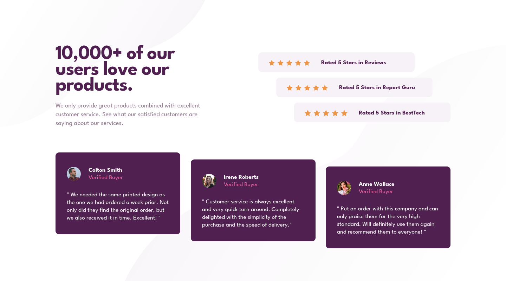
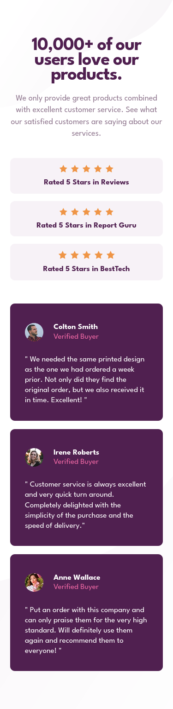

# Frontend Mentor - Social proof section solution

This is a solution to the [Social proof section challenge on Frontend Mentor](https://www.frontendmentor.io/challenges/social-proof-section-6e0qTv_bA). Frontend Mentor challenges help you improve your coding skills by building realistic projects. 

## Table of contents

- [Frontend Mentor - Social proof section solution](#frontend-mentor---social-proof-section-solution)
  - [Table of contents](#table-of-contents)
  - [Overview](#overview)
    - [The challenge](#the-challenge)
    - [Screenshot](#screenshot)
    - [Links](#links)
  - [My process](#my-process)
    - [Built with](#built-with)
    - [What I learned](#what-i-learned)
    - [Continued development](#continued-development)
    - [Useful resources](#useful-resources)
  - [Author](#author)

## Overview

### The challenge

Users should be able to:

- View the optimal layout for the section depending on their device's screen size

### Screenshot




### Links

- Solution URL: [GitHub](https://github.com/juanhastier/social-proof-section)
- Live Site URL: [Social Proof Section](https://juanhastier.github.io/social-proof-section)

## My process

### Built with

- Semantic HTML5 markup
- CSS custom properties
- Flexbox
- CSS Grid
- Mobile-first workflow
- Media Querys

### What I learned

I really enjoyed this project because I learned how to use SVG images as sprites with `<use>`—which is the professional approach:

- The path is defined ONLY ONCE
- Complete color control using `fill` in CSS
- 15 icons, yet ONLY ONE definition
- Easier to maintain

```html
<html>
  <head> ... </head>
  <body>
  <!-- STAR ICON -->
    <svg style="display: none;" xmlns="http://www.w3.org/2000/svg"> 
      <symbol id="icon-star" viewBox="0 0 17 16"> 
        <path d="M16.539 6.097a.297.297 0 00-.24-.202l-5.36-.779L8.542.26a.296.296 0 00-.53 0L5.613 5.117l-5.36.779a.297.297 0 00-.165.505l3.88 3.78-.917 5.34a.297.297 0 00.43.312l4.795-2.52 4.794 2.52a.296.296 0 00.43-.313l-.916-5.338L16.464 6.4c.08-.08.11-.197.075-.304z" fill="#EF9546" fill-rule="nonzero"/> 
      </symbol> 
    </svg> 

    <!-- MAIN HEADER --> 
    <header> ... </header> 
    <!-- RATINGS SECTION (h2 hidden) --> 
    <section class="ratings" aria-labelledby="ratings-heading"> 
      <h2 id="ratings-heading" class="sr-only">Customer ratings</h2> 

      <ul class="ratings__list"> 
        <li class="rating__item"> 
          <div class="ratings__stars" aria-hidden="true"> 
            <svg class="rating__star" width="17" height="16"><use href="#icon-star" /></svg> 
            <svg class="rating__star" width="17" height="16"><use href="#icon-star" /></svg> 
            <svg class="rating__star" width="17" height="16"><use href="#icon-star" /></svg> 
            <svg class="rating__star" width="17" height="16"><use href="#icon-star" /></svg> 
            <svg class="rating__star" width="17" height="16"><use href="#icon-star" /></svg> 
          </div> 
          <p class="rating__text">Rated 5 Stars in Reviews</p> 
        </li> 

        <li class="rating__item"> 
          <div class="ratings__stars" aria-hidden="true"> 
            <svg class="rating__star" width="17" height="16"><use href="#icon-star" /></svg> 
            <svg class="rating__star" width="17" height="16"><use href="#icon-star" /></svg> 
            <svg class="rating__star" width="17" height="16"><use href="#icon-star" /></svg> 
            <svg class="rating__star" width="17" height="16"><use href="#icon-star" /></svg> 
            <svg class="rating__star" width="17" height="16"><use href="#icon-star" /></svg> 
          </div> 
          <p class="rating__text">Rated 5 Stars in Report Guru</p> 
        </li> 

        <li class="rating__item"> 
          <div class="ratings__stars" aria-hidden="true"> 
            <svg class="rating__star" width="18" height="18"><use href="#icon-star" /></svg> 
            <svg class="rating__star" width="18" height="18"><use href="#icon-star" /></svg> 
            <svg class="rating__star" width="18" height="18"><use href="#icon-star" /></svg> 
            <svg class="rating__star" width="18" height="18"><use href="#icon-star" /></svg> 
            <svg class="rating__star" width="18" height="18"><use href="#icon-star" /></svg> 
          </div> 
          <p class="rating__text">Rated 5 Stars in BestTech</p> 
        </li> 
      </ul> 
    </section> 
  </body>
</html>
```

### Continued development

For now, I would like to continue my learning path at Frontend Mentor and thus solve increasingly complex challenges.

### Useful resources

- [MDN](https://developer.mozilla.org/) - I really enjoyed studying on MDN, and I will continue to use it in the future.
- [CSS Tricks: CSS Flexbox Layout Guide](https://css-tricks.com/snippets/css/a-guide-to-flexbox/) - This is an amazing article which helped me finally understand flexbox layout. I'd recommend it to anyone still learning this concept.
- [CSS Tricks: CSS Grid Layout Guide](https://css-tricks.com/complete-guide-css-grid-layout/) - This is an amazing article which helped me finally understand grid layout. I'd recommend it to anyone still learning this concept.

## Author

- Frontend Mentor - [@juanhastier](https://www.frontendmentor.io/profile/juanhastier)